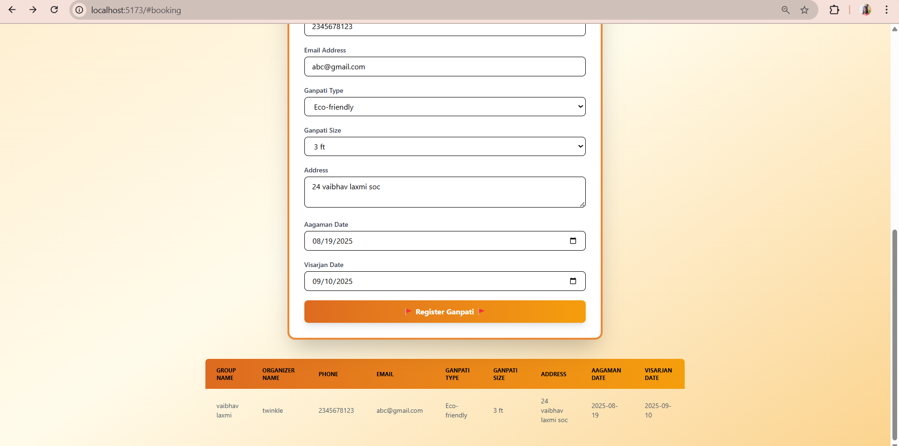

# 🪔 Ganpati Booking / Registration Form  

## ✨ Features  
- Collects details: **Name, Phone, Email, Address, Date/Time, Number of People, Notes**.  
- **Image upload with live preview**.  
- Saves entries in **localStorage** (no backend needed).  
- View and Delete entries easily.  
- Simple, responsive **UI with CSS**.  

---

## 📸 Screenshots  

### Form Example  
  

### Table Example  
  
---

## 🚀 How to Run Locally  
1. Download or clone this repository.  
2. Keep all files (`index.html`, `styles.css`, `script.js`) in the same folder.  
3. Open `index.html` in your browser.  
4. Fill in the form and click **Submit** — your entry will appear in the list below.  

---

## 📌 Use Cases  
- Ganpati arrival event registration (society, temple, or village).  
- RSVP system for community functions.  
- Attendance/visitor tracking for cultural programs.  

---

## 🔮 Future Enhancements  
- Backend (Node.js/Express + MongoDB) integration.  
- Email/SMS notifications (Nodemailer, Twilio).  
- Admin dashboard with **edit, filter, search** options.  
- OTP/Email verification for security.  

---

## 📜 License  

MIT License  

