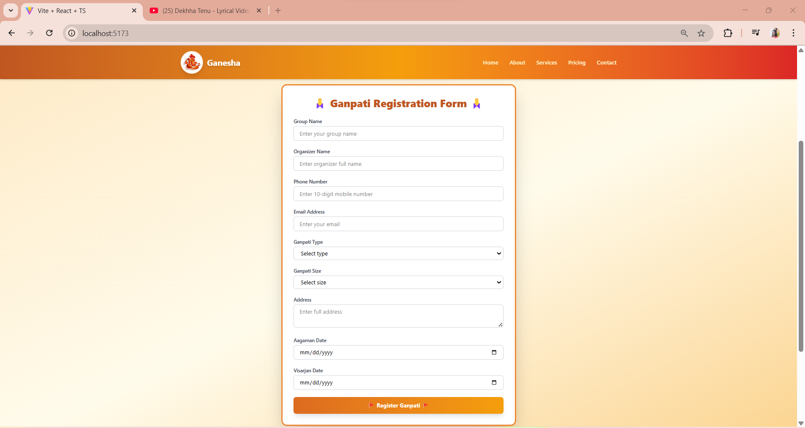
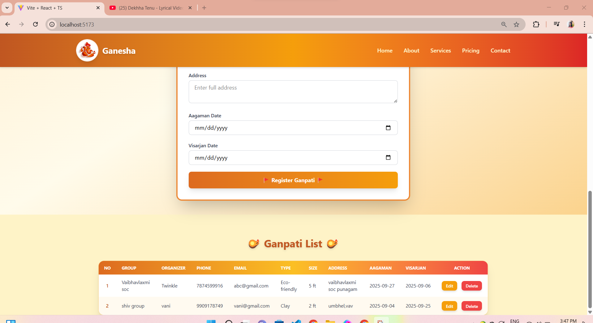

# 🙏 Ganpati Registration App 🙏

A modern **Ganpati Registration and Management Web Application** built with **React + Tailwind CSS**.  
This app allows groups/organizations to register their Ganpati details and manage them (Add, Edit, Delete).  

---

## 🚀 Features

- 📝 **Ganpati Registration Form**
- ✅ Form Validation with error messages
- 📦 Data persistence using **LocalStorage**
- 📋 Ganpati List Table with perfect alignment
- ✏️ Update/Edit Ganpati records
- ❌ Delete Ganpati records with confirmation alert
- 🎉 Toast notifications for success actions
- 🎨 Responsive and colorful UI with Tailwind CSS
- 🔔 SweetAlert2 for beautiful confirmation dialogs

---

## 🛠️ Tech Stack

- ⚛️ **React.js** (with Hooks: useState, useEffect)
- 🎨 **Tailwind CSS** for styling
- 🍞 **React Toastify** for notifications
- ⚡ **SweetAlert2** for alerts
- 💾 LocalStorage for saving data

---

## 📸 Screenshots

### 📝 Registration Form  

### 📋 Ganpati List Table  

---
## License

MIT License

Copyright (c) 2025 NencyMaisuriya21

Permission is hereby granted, free of charge, to any person obtaining a copy
of this software and associated documentation files (the "Software"), to deal
in the Software without restriction, including without limitation the rights
to use, copy, modify, merge, publish, distribute, sublicense, and/or sell
copies of the Software, and to permit persons to whom the Software is
furnished to do so, subject to the following conditions:

The above copyright notice and this permission notice shall be included in all
copies or substantial portions of the Software.

THE SOFTWARE IS PROVIDED "AS IS", WITHOUT WARRANTY OF ANY KIND, EXPRESS OR
IMPLIED, INCLUDING BUT NOT LIMITED TO THE WARRANTIES OF MERCHANTABILITY,
FITNESS FOR A PARTICULAR PURPOSE AND NONINFRINGEMENT. IN NO EVENT SHALL THE
AUTHORS OR COPYRIGHT HOLDERS BE LIABLE FOR ANY CLAIM, DAMAGES OR OTHER
LIABILITY, WHETHER IN AN ACTION OF CONTRACT, TORT OR OTHERWISE, ARISING FROM,
OUT OF OR IN CONNECTION WITH THE SOFTWARE OR THE USE OR OTHER DEALINGS IN THE
SOFTWARE.

