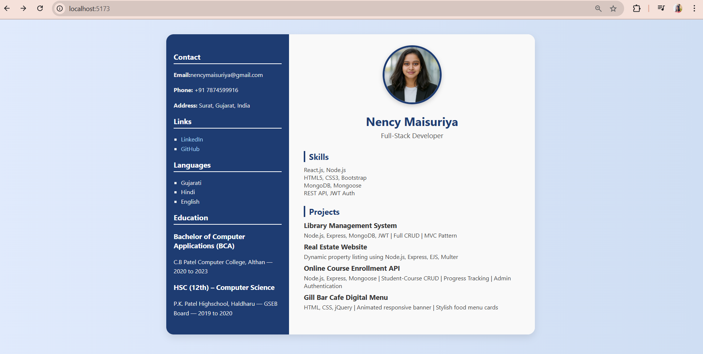

<h1 align="center">💼 Nency's Resume App</h1>

  
  
  

  A sleek, responsive <strong>React.js</strong> resume app that showcases your profile, skills, education, and projects — all in one elegant page.

---

## ✨ Highlights
> 🚀 Built with **React + Vite** for blazing-fast performance.  
> 🎨 Modern and responsive layout with clean design.  
> 🛠 Easy to customize for anyone's portfolio.  

---

## 🖼️ Preview

  

---

## 🌐 Live Demo
🔗 **[View Project Live](http://localhost:5173/)**  
*(Replace with GitHub Pages, Netlify, or Vercel deployment link)*

---

## 🛠️ Tech Stack
| Frontend | Build Tool | Package Manager |
|----------|-----------|----------------|
|  |  |  |

---

